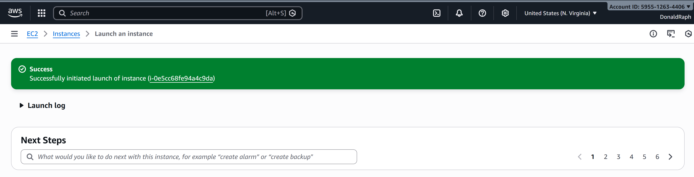
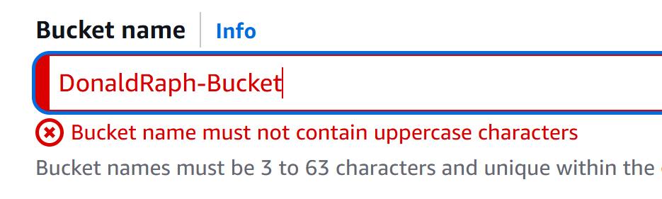

# Week 1 – Cloud Engineering Foundations ☁️


## Overview
This week i focused on building a strong foundation in **cloud engineering**.  
I set up my cloud environment, explored core AWS services, and practiced basic Linux commands commonly used in cloud and DevOps workflows.

---

## Objectives
- Understand what cloud computing is and how AWS works
- Create and secure an AWS Free Tier account
- Get hands-on experience with core AWS services
- Learn essential Linux commands used on cloud servers

---

## What I Learned

### 1. AWS Free Tier Account Setup
- Created an AWS Free Tier account
- Learned about:
  - AWS Management Console
  - IAM basics (users, permissions - high level)
  - AWS regions and availability zones
- Understood Free Tier limits and billing awareness

---

### 2. Amazon EC2 (Elastic Compute Cloud)

- Launched my first EC2 instance using the AWS Management Console
- Selected instance type and key pair
- Configured basic security group rules
- Successfully initiated the instance launch



This screenshot confirms a successful EC2 instance launch.


---

### 3. Amazon S3 (Simple Storage Service)
- Learned what object storage is
- Created an S3 bucket
- Uploaded files to S3
- Understood:
  - Buckets vs Objects
  - Public vs private access
  - Basic use cases (backups, static websites)
- Learned about S3 bucket naming rules and constraints

#### S3 Bucket Naming Rules (Important)



While creating an S3 bucket, I encountered a validation warning indicating that:
- Bucket names must use **lowercase letters only**
- No uppercase characters are allowed
- Bucket names must be globally unique

This helped me understand that S3 bucket names are part of a **global namespace**, similar to domain names.
---

### 4. Linux Basics
Practiced common Linux commands used on cloud servers:

```bash
pwd        # show current directory
ls         # list files
cd         # change directory
mkdir      # create directory
touch      # create file
rm         # remove file
